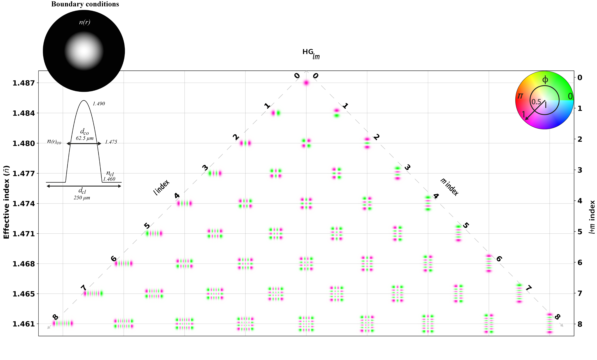
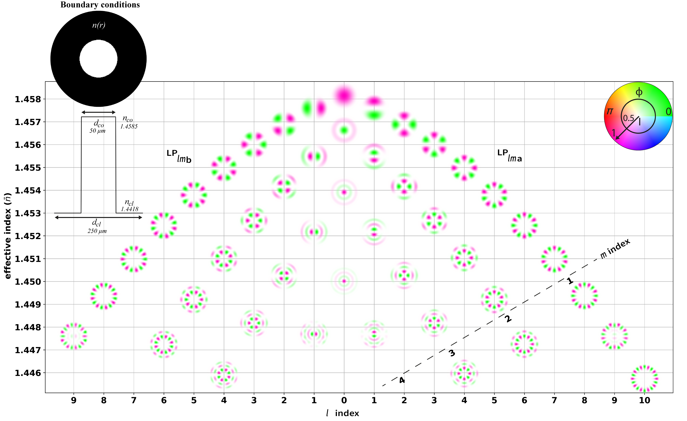

# Calculate Fibre Modes

## Scalar mode solver
Solve scalar wave equation under arbitrary refractive index profile (WEAKLY GUIDING FIBRES)

### Module: scalarmodesolver.py

### Examples: scalarmodesolver_examples.ipynb

### Solutions examples:

## Analytical solution for GI fibres

### GI modes module: ModesGen.py

### HG modes: Not supported in this version yet