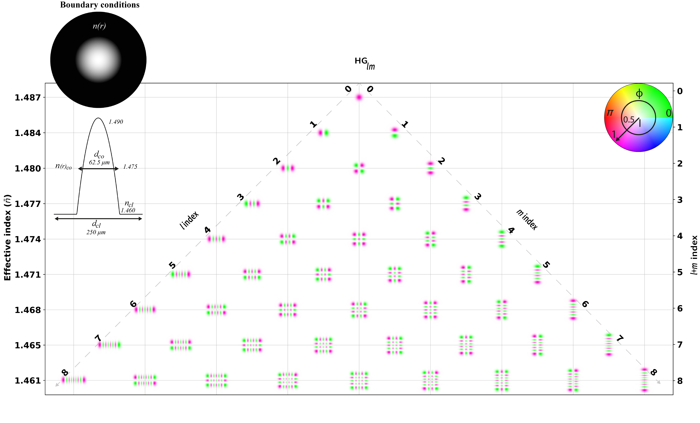
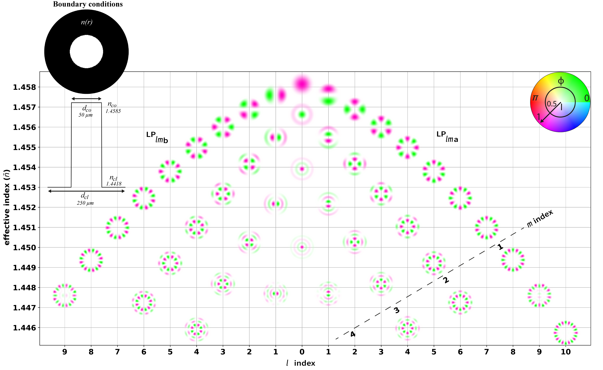

# Calculate Fibre Modes

## Package layout

```
fibremodes/
├── solvers/              numerical eigenmode solver
├── analytical/
│   ├── LG/               Laguerre-Gaussian modes (ModesGen + toolbox)
│   └── HG/               placeholder (not implemented)
├── utilities/            overlaps, transmission-matrix tools
└── tests/                notebooks and future pytest
```

Root-level `ModesGen.py`, `mode_generation_core_library.py`, and `scalarmodesolver.py` are deprecated compatibility shims.

## Scalar mode solver

Solve scalar wave equation under arbitrary refractive index profile (weakly guiding fibres).

- Module: `fibremodes.solvers.scalarmodesolver`
- Examples: `tests/scalarmodesolver_examples.ipynb`

### Solutions examples




## Analytical solution for GI fibres (LG modes)

- High-level API: `fibremodes.analytical.LG.ModesGen` (`LGmodes` class)
- Low-level toolbox: `fibremodes.analytical.LG.toolbox`

### GPU speed-up for Laguerre polynomials

LG modes for graded-index fibres use the standard near-field form

$$
LG_{p,\ell}(\rho,\phi) \propto \frac{1}{w_0}\left(\frac{\rho}{w_0}\right)^{|\ell|}
  e^{-\rho^2/w_0^2}\, e^{-i\ell\phi}\,
  L_p^{|\ell|}\!\left(\frac{2\rho^2}{w_0^2}\right)
$$

where $L_p^\ell$ is the **generalized Laguerre polynomial**, $p$ is the radial index, $\ell$ the azimuthal index, and $w_0 = \mathrm{MFD}/2$.

The expensive step is evaluating $L_p^\ell(x)$ on a 2D grid for every $(p,\ell)$ pair in a mode group. The CPU path calls `scipy.special.eval_genlaguerre` mode by mode; for large mode groups and grid sizes (e.g. group 20 at 960×960) this is very slow because SciPy evaluates each polynomial independently over the full grid.

The GPU path (`engine='GPU'`, default) avoids that loop by using the **closed-form sum definition** instead of SciPy's iterative evaluation:

$$
L_p^\ell(x) = \sum_{k=0}^{p} (-1)^k \frac{(p+\ell)!}{k!\,(p-k)!\,(\ell+k)!}\, x^k
$$

Implementation in `analytical/LG/toolbox/mode_generation_core_library.py`:

1. **`Okernel(p, l, k)`** — precompute the factorial coefficients for all modes and $k$ indices (CPU).
2. **`eval_genlaguerreGPU`** — build a power matrix `(-1)^k x^k` on the GPU once (shared across modes), multiply by the coefficients, and sum over $k$ in a single batched CuPy operation so **all modes are computed together**.
3. **`LGmodes_GPU`** — apply the LG envelope (Gaussian, azimuthal phase, radial factor) and normalize, again vectorized over all modes.

This turns “$N_\mathrm{modes}$ sequential SciPy calls” into one GPU-friendly tensor contraction, which is where most of the speed-up comes from.

If GPU memory is tight, `eval_genlaguerreGPU` automatically falls back to chunked evaluation (see the memory check and block loop in that function). For very large grids or mode groups, reduce resolution, mode group, or ensure enough VRAM.

Example:

```python
from fibremodes.analytical.LG.ModesGen import LGmodes

LGbases = LGmodes(
    mfd=34, group=20, N=960, px_size=1,
    generateModes=True, wholeSet=True,
    engine="GPU",  # uses eval_genlaguerreGPU + LGmodes_GPU
)
```

## Utilities

- `fibremodes.utilities.overlaps` — modal decomposition / reconstruction
- `fibremodes.utilities.transmission_matrix_generator` — synthetic MMF transmission matrices

## HG modes

Not supported in this version yet (`analytical/HG/` is a placeholder).

## Canonical imports

```python
from fibremodes.solvers.scalarmodesolver import scalarmodeEigsSolver
from fibremodes.analytical.LG.ModesGen import LGmodes
from fibremodes.analytical.LG.toolbox import ComputeAllLGmodes_list, graded_index_fiber_coefs
from fibremodes.utilities.overlaps import overlaps
```

## Environment setup

```bash
conda create -n fibremodes python=3.11 -y
conda activate fibremodes
pip install -r requirements.txt
```

`requirements.txt` includes `cupy-cuda13x` for CUDA toolkit 13.x (e.g. 13.2). The toolkit installer sets system `CUDA_PATH`, but terminals/Jupyter kernels started **before** install (or outside conda) may not see it.

This env sets `CUDA_PATH` via `conda env config vars` and prepends `%CUDA_PATH%\bin` on `conda activate fibremodes`. **Restart the Jupyter kernel** after activating.

Register the Jupyter kernel (once):

```bash
python -m ipykernel install --user --name fibremodes --display-name "Python (fibremodes)"
```

Add `C:\Users\ModeLabQBI\LAB\algorithms` to `PYTHONPATH` so `import fibremodes` works.
