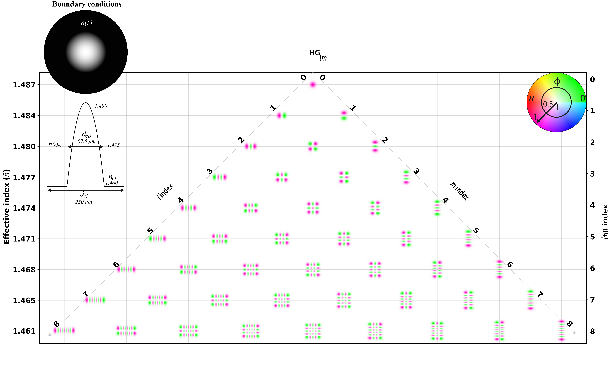
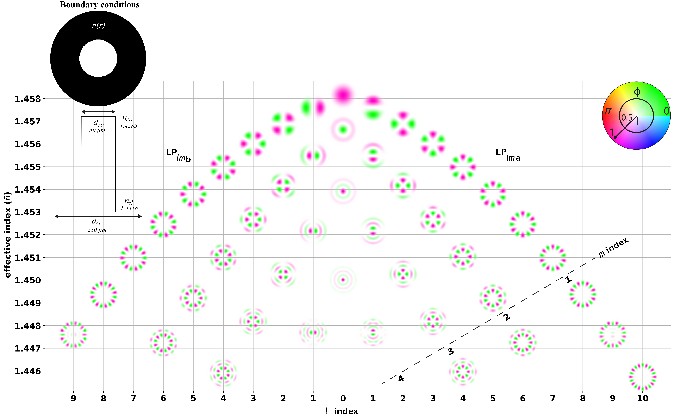

# Calculate Fibre Modes

## Package layout

```
fibremodes/
├── solvers/              numerical eigenmode solver
├── analytical/
│   ├── LG/               Laguerre-Gaussian modes (ModesGen + toolbox)
│   └── HG/               Hermite-Gaussian modes (CPU, separable 1D)
├── utilities/            overlaps, transmission-matrix tools
└── tests/                notebooks and future pytest
```

Root-level `ModesGen.py`, `mode_generation_core_library.py`, and `scalarmodesolver.py` are deprecated compatibility shims.

## Scalar mode solver

`scalarmodeEigsSolver` (`fibremodes.solvers.scalarmodesolver`) computes the guided modes of a weakly guiding fibre for an arbitrary refractive-index profile \(n(x,y)\). A mode with propagation factor \(e^{-i\beta z}\) satisfies the scalar Helmholtz equation

$$
\nabla_\perp^2 E(x,y) + k_0^2 n^2(x,y)\, E(x,y) = \beta^2 E(x,y),
$$

where \(k_0 = 2\pi/\lambda\). The mode field \(E\) and \(\beta^2\) are the eigenfunction and eigenvalue.

On a Cartesian grid this is the five-point stencil

$$
\begin{aligned}
&\frac{E_{i,j+1}+E_{i,j-1}}{\Delta x^2}
+\frac{E_{i+1,j}+E_{i-1,j}}{\Delta y^2}\\
&+\left(k_0^2 n_{i,j}^2-\frac{2}{\Delta x^2}-\frac{2}{\Delta y^2}\right)E_{i,j}
=\beta^2 E_{i,j}.
\end{aligned}
$$

The stencil is stored as a sparse matrix and solved with `scipy.sparse.linalg.eigsh`, shifted to \(\max(k_0 n)^2\), so the \(K\) eigenvalues found are the largest \(\beta^2\) (the guided modes). The returned `beta` array is these eigenvalues \(\beta^2\), in ascending order. The effective index is

$$
n_\mathrm{eff}=\frac{\beta}{k_0}=\frac{\sqrt{\texttt{beta}}}{k_0}.
$$

`kk.max()` is \(\max(k_0 n)^2\), the shift used by the eigensolver. The example notebook plots `beta / kk.max() * n_peak`, which equals \(n_\mathrm{eff}^2 / n_\mathrm{peak}\).

Boundary keys `bc['l']`, `bc['r']`, `bc['t']`, `bc['b']` close the grid with a ghost point half a step outside the domain:

- `'a'` (the default): odd reflection, so \(E = 0\) on that outer edge.
- any other value: even reflection, so the normal derivative vanishes.

Use a slightly rectangular grid (`dy = dx + 1e-11` in the examples). That split lifts the degeneracy of LP pairs and aligns the eigenvectors with the \(x\) and \(y\) axes.

- Examples: `tests/scalarmodesolver_examples.ipynb`

### Solutions examples




## Analytical solution for GI fibres (LG modes)

- High-level API: `fibremodes.analytical.LG.ModesGen` (`LGmodes` class)
- Low-level toolbox: `fibremodes.analytical.LG.toolbox`

### GPU speed-up for Laguerre polynomials

LG modes for graded-index fibres use the standard near-field form

$$
LG_{p,\ell}(\rho,\phi) \propto \frac{1}{w_0}\left(\frac{\rho}{w_0}\right)^{|\ell|}
  e^{-\rho^2/w_0^2}\, e^{-i\ell\phi}\,
  L_p^{|\ell|}\!\left(\frac{2\rho^2}{w_0^2}\right)
$$

where $L_p^\ell$ is the **generalized Laguerre polynomial**, $p$ is the radial index, $\ell$ the azimuthal index, and $w_0 = \mathrm{MFD}/2$.

The expensive step is evaluating $L_p^\ell(x)$ on a 2D grid for every $(p,\ell)$ pair in a mode group. The CPU path calls `scipy.special.eval_genlaguerre` mode by mode; for large mode groups and grid sizes (e.g. group 20 at 960×960) this is very slow because SciPy evaluates each polynomial independently over the full grid.

The GPU path (`engine='GPU'`, default) avoids that loop by using the **closed-form sum definition** instead of SciPy's iterative evaluation:

$$
L_p^\ell(x) = \sum_{k=0}^{p} (-1)^k \frac{(p+\ell)!}{k!\,(p-k)!\,(\ell+k)!}\, x^k
$$

Implementation in `analytical/LG/toolbox/mode_generation_core_library.py`:

1. **`Okernel(p, l, k)`** — precompute the factorial coefficients for all modes and $k$ indices (CPU).
2. **`eval_genlaguerreGPU`** — build a power matrix `(-1)^k x^k` on the GPU once (shared across modes), multiply by the coefficients, and sum over $k$ in a single batched CuPy operation so **all modes are computed together**.
3. **`LGmodes_GPU`** — apply the LG envelope (Gaussian, azimuthal phase, radial factor) and normalize, again vectorized over all modes.

This turns “$N_\mathrm{modes}$ sequential SciPy calls” into one GPU-friendly tensor contraction, which is where most of the speed-up comes from.

If GPU memory is tight, `eval_genlaguerreGPU` automatically falls back to chunked evaluation (see the memory check and block loop in that function). For very large grids or mode groups, reduce resolution, mode group, or ensure enough VRAM.

Example:

```python
from fibremodes.analytical.LG.ModesGen import LGmodes

LGbases = LGmodes(
    mfd=34, group=20, N=960, px_size=1,
    generateModes=True, wholeSet=True,
    engine="GPU",  # uses eval_genlaguerreGPU + LGmodes_GPU
)
```

## Utilities

- `fibremodes.utilities.overlaps` — modal decomposition / reconstruction
- `fibremodes.utilities.transmission_matrix_generator` — synthetic MMF transmission matrices

## Analytical HG modes

- Module: `fibremodes.analytical.HG.fibremodes` (`makeHGModes`)

Hermite-Gaussian modes are **separable** in Cartesian coordinates. Each 1D profile is

$$
\mathrm{HG}_J(x) = \left(\frac{2}{\pi\, 2^J J!\, w_0}\right)^{1/2}
  H_J\!\left(\frac{\sqrt{2}}{w_0}\,x\right)
  \exp\!\left(-\frac{x^2}{w_0^2}\right)
$$

where $H_J$ is the physicist's Hermite polynomial (`scipy.special.eval_hermite`), $J$ is the mode order along one axis, and $w_0$ is the Gaussian beam waist (same convention as LG: $w_0 = \mathrm{MFD}/2$).

The 2D mode is the outer product of two 1D profiles:

$$
\mathrm{HG}_{m,n}(x,y) = \mathrm{HG}_m(x)\,\mathrm{HG}_n(y)
$$

`makeHGModes` builds a **triangular mode group** of size $G$: for each $i = 0,\ldots,G-1$ it emits all pairs $(m,n)$ with $m+n=i$, giving $G(G+1)/2$ modes in total.

### CPU implementation (fast via separability)

This path is CPU-only (NumPy/SciPy), but it stays fast because the expensive Hermite evaluation runs on **1D coordinate vectors** only. For grid size $N_f \times N_f$:

1. Build 1D samples $x = [-N_f/2,\ldots,N_f/2-1]$.
2. Evaluate $G$ distinct 1D profiles $\mathrm{HG}_J(x)$ once (`makebasis` / `HG`).
3. Form each 2D mode as an outer product with `einsum('...ki,...kj->kij', targetY, targetX)` — no 2D Hermite loop.

So cost scales like $\mathcal{O}(G\,N_f + G^2 N_f^2)$ for the outer products, rather than evaluating polynomials on every $(x,y)$ pixel for every mode.

Example:

```python
from fibremodes.analytical.HG.fibremodes import makeHGModes

# Nf x Nf grid, beam waist w0, G mode groups -> G*(G+1)/2 modes
HGmodes = makeHGModes(Nf=512, w0=17, G=16)
# shape: (mode_index, Nf, Nf)
```

## Canonical imports

```python
from fibremodes.solvers.scalarmodesolver import scalarmodeEigsSolver
from fibremodes.analytical.LG.ModesGen import LGmodes
from fibremodes.analytical.LG.toolbox import ComputeAllLGmodes_list, graded_index_fiber_coefs
from fibremodes.analytical.HG.fibremodes import makeHGModes
from fibremodes.utilities.overlaps import overlaps
```

## Installation

### From GitHub (tagged release)

```bash
pip install "fibremodes[gpu] @ git+https://github.com/MarKo7s/fibremodes.git@v1.0.0"
```

Other packages can pin the same dependency in `requirements.txt`:

```text
fibremodes[gpu] @ git+https://github.com/MarKo7s/fibremodes.git@v1.0.0
```

### Local development (editable install)

```bash
git clone git@github.com:MarKo7s/fibremodes.git
cd fibremodes
pip install -e ".[gpu,parallel,notebooks]"
```

### Conda environment

```bash
conda create -n fibremodes python=3.11 -y
conda activate fibremodes
pip install -e ".[gpu,parallel,notebooks]"
```

`cupy-cuda13x` targets CUDA toolkit 13.x (e.g. 13.2). The toolkit installer sets system `CUDA_PATH`, but terminals/Jupyter kernels started **before** install (or outside conda) may not see it.

This env can set `CUDA_PATH` via `conda env config vars` and prepend `%CUDA_PATH%\bin` on `conda activate fibremodes`. **Restart the Jupyter kernel** after activating.

Register the Jupyter kernel (once):

```bash
python -m ipykernel install --user --name fibremodes --display-name "Python (fibremodes)"
```

`requirements.txt` remains available for legacy workflows; prefer `pip install -e ".[gpu]"` for package installs.

## Developer notes

### Versioning

The package version is defined in **one place only**: `pyproject.toml` → `[project].version`.

Do **not** edit `__init__.py` on each release. `fibremodes.__version__` is read from pip metadata after install (`importlib.metadata`).

Check the installed version:

```bash
pip show fibremodes
python -c "import fibremodes; print(fibremodes.__version__)"
```

Use [semantic versioning](https://semver.org/): `MAJOR.MINOR.PATCH` (e.g. `1.0.0` → `1.0.1` for fixes, `1.1.0` for features).

### Releasing a new version

1. Add an entry for the new version at the top of `CHANGELOG.md`.
2. Bump `version` in `pyproject.toml`.
3. Commit all changes (including the changelog).
4. Run the release script from the repo root:

```bash
python scripts/release.py --from-changelog
```

The script reads the version from `pyproject.toml`, pushes `main`, creates annotated git tag `vX.Y.Z`, and pushes the tag. With `--from-changelog`, the tag message is taken from the matching `CHANGELOG.md` section. You can also pass a custom message with `--message "..."` (overrides `--from-changelog`).

After that, others can install with:

```bash
pip install "fibremodes[gpu] @ git+https://github.com/MarKo7s/fibremodes.git@vX.Y.Z"
```

Dry run (no git changes):

```bash
python scripts/release.py --from-changelog --dry-run
```

Optional: create a GitHub Release page with the same notes (`gh` CLI required):

```bash
gh release create vX.Y.Z --title "fibremodes X.Y.Z" --notes-file CHANGELOG.md
```

**Requirements before release:** clean working tree (all changes committed); tag `vX.Y.Z` must not already exist on GitHub.

### First-time packaging (maintainers)

After cloning, use editable install for development:

```bash
pip install -e ".[gpu,parallel,notebooks]"
```
